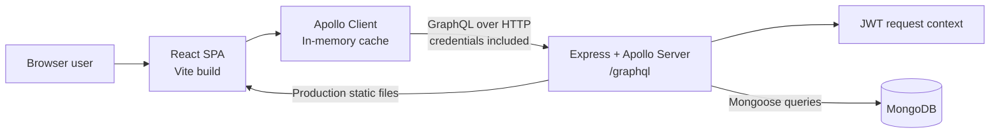
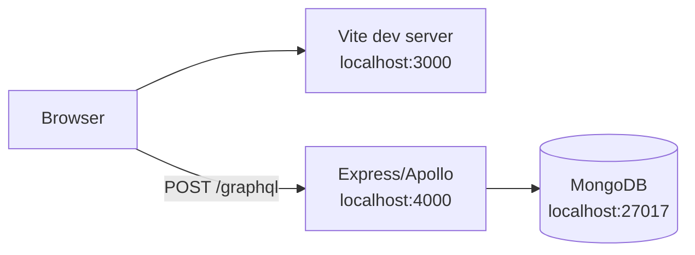
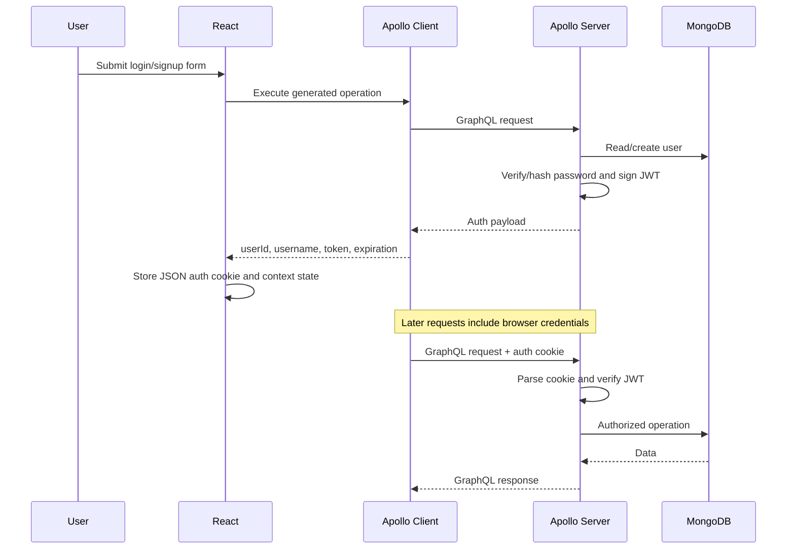

# Architecture

> **Status:** Current-state architecture with explicitly marked evolution guidance  
> **Repository:** `adamcalledback/react-event-scheduler`  
> **Analyzed branch:** `main`  
> **Analyzed commit:** `e92a045c6e688795c41bf89926f5fccb4514d760`  
> **Last reviewed:** 2026-07-24

## 1. Executive summary

Event Scheduler is a **full-stack modular monolith** maintained in one TypeScript repository.

The system consists of:

- a React single-page application built with Vite;
- an Apollo Client GraphQL integration;
- an Express application hosting Apollo Server;
- MongoDB persistence through Mongoose;
- JWT-based authentication stored in a browser cookie;
- one shared GraphQL schema used to generate frontend operations and TypeScript types.

In local development, the frontend and backend run as separate processes. In a built deployment, the backend is also capable of serving the compiled frontend from `dist/`.



The application is small enough that this architecture is appropriate. Its main scaling limitation is not process topology; it is **code-level coupling**. UI pages, GraphQL operations, authorization checks, query construction, persistence, and response shaping are currently concentrated into a small number of modules.

---

## 2. Architectural goals

The implemented architecture supports the following product capabilities:

- user signup and login;
- public and private events;
- event creation, editing, deletion, search, filtering, and pagination;
- calendar and list-oriented event views;
- user profile and user-specific event views;
- shareable event URLs;
- automatic logout after client inactivity.

The architecture currently optimizes for:

1. **A single repository and deployment unit.**
2. **Fast feature delivery with minimal infrastructure.**
3. **End-to-end TypeScript types generated from GraphQL.**
4. **Server-side enforcement of event ownership and privacy.**
5. **Reusable React presentation components.**

It does not currently optimize for independent service deployment, very large data volumes, multi-region availability, asynchronous processing, or multiple API consumers with separately versioned contracts.

---

## 3. Repository structure

```text
.
├── api/
│   ├── index.ts                    # Express, Apollo, MongoDB, and HTTP bootstrap
│   ├── graphql/
│   │   ├── schema/index.ts         # GraphQL schema
│   │   └── resolvers/              # Auth, event, and user operations
│   ├── middleware/auth.ts          # JWT cookie parsing and request context
│   ├── models/                     # Mongoose schemas and models
│   ├── interfaces/                 # Backend TypeScript interfaces
│   └── utils/                      # Backend validation helpers
├── src/
│   ├── main.tsx                    # React bootstrap
│   ├── App.tsx                     # Application providers and shell
│   ├── Routes.tsx                  # Client-side routes
│   ├── apolloClient.tsx            # Apollo links, cache, and global errors
│   ├── generated/graphql.tsx       # Generated GraphQL types and hooks
│   ├── graphql/                    # Operations and fragments used by codegen
│   ├── pages/                      # Route-level feature components
│   ├── components/                 # Reusable UI and feature components
│   ├── store/                      # Authentication context/provider
│   ├── hooks/                      # Shared React hooks
│   └── utils/                      # Cache and date helpers
├── .github/workflows/main.yml      # Build, lint, compile, test, and coverage CI
├── codegen.yml                     # GraphQL Code Generator configuration
├── vite.config.mts                 # Frontend build and development server
├── vercel.json                     # Vercel rewrite configuration
└── package.json                    # Unified frontend/backend scripts and dependencies
```

### Source-of-truth ownership

| Concern | Primary source of truth |
|---|---|
| GraphQL API shape | `api/graphql/schema/index.ts` |
| Frontend GraphQL operations | `src/graphql/*.graphql` |
| Generated GraphQL types/hooks | `src/generated/graphql.tsx` |
| Persistent data shape | `api/models/*.ts` |
| Authentication request context | `api/middleware/auth.ts` |
| Client authentication state | `src/store/AuthProvider.tsx` and `src/hooks/useAuth.tsx` |
| Client routes | `src/Routes.tsx` |
| Runtime configuration | `.env` based on `.env.example` |

`src/generated/graphql.tsx` is generated output and must not be edited manually.

---

## 4. Runtime topology

### 4.1 Local development

The default development topology uses three runtime dependencies:



Environment defaults are documented in `.env.example`:

| Variable | Purpose | Local example |
|---|---|---|
| `VITE_APP_GRAPHQL_ENDPOINT` | Browser-visible GraphQL endpoint | `http://localhost:4000/graphql` |
| `URI` | Allowed frontend CORS origin and shared-event URL base | `http://localhost:3000` |
| `PORT` | Express/Apollo HTTP port | `4000` |
| `MONGODB_URI` | MongoDB connection string | `mongodb://127.0.0.1:27017/EventScheduler` |
| `JWT_SECRET` | JWT signing and verification secret | local placeholder only |

The root `yarn start` command uses `npm-run-all` to run the frontend and backend concurrently.

### 4.2 Built application

`yarn build` runs TypeScript compilation followed by `vite build`, producing the frontend bundle in `dist/`.

The Express application:

- serves `dist/` as static files;
- returns `dist/index.html` for SPA routes;
- exposes Apollo Server at `/graphql`;
- opens the MongoDB connection before listening for traffic.

The repository also contains a Vercel rewrite that routes all incoming paths to `/api`. Because the repository combines a long-running Express bootstrap, static serving, and serverless-oriented routing configuration, deployment behavior should be validated whenever the hosting model changes. Do not assume that a new platform will reproduce the current process lifecycle without adaptation.

---

## 5. Frontend architecture

### 5.1 Application bootstrap and providers

`src/main.tsx` mounts the application with this provider order:

```text
React.StrictMode
└── AuthProvider
    └── BrowserRouter
        └── App
            └── ApolloProvider
                └── AppRoutes
```

This ordering has two consequences:

1. authentication state is available to the application shell and Apollo-driven pages;
2. Apollo Client is instantiated globally but provided inside `App`, below the authentication provider.

`App.tsx` also owns application-wide concerns:

- idle-session logout;
- the route tree;
- the footer;
- global toast rendering.

### 5.2 Routing

`src/Routes.tsx` defines browser routes for:

| Route | Feature |
|---|---|
| `/` | Welcome page |
| `/searchEvents` | Searchable and paginated event list |
| `/addEvent` | Event creation form |
| `/calendar` | FullCalendar event view and editing |
| `/sharedEvent/:id` | Shared event view |
| `/user/:id/profile` | User profile |
| `/user/:id/events` | Current user's events |
| `/user/:id/settings` | User settings |
| `*` | Not-found page |

Routes are not centrally guarded. Pages render according to authentication state, while the backend remains the authoritative enforcement point for protected data and mutations.

### 5.3 State model

The frontend uses three forms of state:

| State category | Mechanism | Examples |
|---|---|---|
| Server state | Apollo Client cache | events, users, mutation results |
| Session state | React context plus browser cookie | current user ID, username, JWT, expiration |
| View state | Local React state and refs | forms, modals, filters, pagination, loading flags |

There is no global client state store beyond authentication. Feature pages own their data-fetching and interaction state directly.

### 5.4 GraphQL client

`src/apolloClient.tsx` configures:

- `HttpLink` using `VITE_APP_GRAPHQL_ENDPOINT`;
- `credentials: 'include'`, allowing the authentication cookie to be sent;
- `InMemoryCache` for normalized server state;
- a global error link.

The global error link:

- logs GraphQL errors;
- removes authentication and redirects to `/` when the server returns `Unauthenticated`;
- displays a toast for network failures.

Feature pages generally use generated hooks such as:

- `useGetEventsQuery`;
- `useGetEventsLazyQuery`;
- `useSaveEventMutation`;
- `useDeleteEventMutation`;
- `useLoginLazyQuery`;
- `useSignupMutation`.

Cache synchronization is a mix of Apollo normalization, explicit cache removal in `src/utils/apolloCache`, refetching, and occasional `client.resetStore()` calls.

### 5.5 Feature composition

Route-level pages are currently **smart components**. They commonly own:

- GraphQL calls;
- form state;
- validation outcomes;
- modal state;
- authorization-driven button state;
- toast and error behavior;
- Apollo cache updates;
- view-specific transformations.

Examples include `Calendar.tsx`, `SearchEvents.tsx`, `AddEvent.tsx`, and `LoginContainer.tsx`.

Reusable components under `src/components/` provide forms, modal shells, alerts, cards, pagination, navigation, timers, and event form bodies. The division is therefore:

```text
pages = orchestration + data + interaction state
components = reusable rendering and focused interaction pieces
```

There is no distinct frontend application-service or repository layer.

---

## 6. Backend architecture

### 6.1 HTTP and application bootstrap

`api/index.ts` performs all server startup responsibilities:

1. load environment variables;
2. create the Express application;
3. install cookie, compression, JSON, and URL-encoded middleware;
4. configure static frontend serving and SPA fallback;
5. create an HTTP server;
6. create and start Apollo Server;
7. mount GraphQL at `/graphql` with CORS and request context;
8. connect Mongoose to MongoDB;
9. listen on `PORT`.

Apollo's drain plugin coordinates graceful HTTP server shutdown.

### 6.2 GraphQL schema and resolver dispatch

The GraphQL schema is declared in `api/graphql/schema/index.ts`.

Resolvers are exported as a flat `rootValue` object assembled from:

- `Auth`;
- `Events`;
- `Users`.

Each exported function name matches a root GraphQL field. This is simpler than a nested resolver map, but it means all root operations share one namespace and field-level resolver organization is limited.

### 6.3 Resolver responsibilities

Resolvers currently combine several concerns:

```text
GraphQL input
  → authentication/authorization checks
  → input validation
  → MongoDB filter construction
  → Mongoose query/update
  → population and response shaping
  → GraphQL/domain error creation
```

There is no separate controller, application service, domain service, or persistence repository layer. For the current system size, that reduces indirection. As feature complexity grows, it increases duplication and makes business rules harder to test independently from GraphQL and Mongoose.

### 6.4 Backend modules

#### Authentication resolvers

`api/graphql/resolvers/auth.ts` is responsible for:

- signup validation;
- duplicate username detection;
- bcrypt password hashing with cost factor 12;
- password verification;
- one-hour JWT creation;
- login and signup responses.

#### Event resolvers

`api/graphql/resolvers/events.ts` is responsible for:

- public/private visibility filtering;
- text search;
- current/expired and date-window filtering;
- pagination;
- event lookup;
- owner-only updates and deletion;
- share URL generation;
- Mongoose population of `createdBy`.

#### User resolvers

`api/graphql/resolvers/users.ts` is responsible for:

- authenticated profile retrieval;
- self-only profile updates;
- duplicate username checks during updates.

---

## 7. Data architecture

MongoDB is accessed directly through Mongoose models.

### 7.1 User document

`api/models/user.ts` defines:

```text
User
├── username: string, required
├── password: string, required, bcrypt hash
├── firstName?: string
├── lastName?: string
├── email?: string
├── phoneNumber?: string
├── bio?: string
├── createdEvents?: ObjectId[] → Event
├── createdAt: timestamp
└── updatedAt: timestamp
```

The `createdEvents` relationship exists in the schema, but current event write resolvers do not maintain this array. The authoritative event-to-user relationship is the event's `createdBy` field.

### 7.2 Event document

`api/models/event.ts` defines:

```text
Event
├── title: string, required
├── start: string, required
├── end: string, required
├── description?: string
├── url?: string
├── isPrivate?: boolean
├── createdBy: ObjectId → User
├── createdAt: timestamp
└── updatedAt: timestamp
```

Dates are persisted as strings. Query behavior therefore assumes consistently formatted, lexicographically sortable ISO date strings. This works for current inputs, but it is weaker than native MongoDB `Date` values for validation, indexing, timezone handling, and date arithmetic.

No explicit model indexes are defined in the repository. Search and pagination currently rely on regular-expression queries and general document scans as the dataset grows.

---

## 8. GraphQL contract and type generation

### 8.1 Operations

The schema exposes these root fields:

| GraphQL type | Field | Access |
|---|---|---|
| Query | `eventsData` | Public, with private owner events added for authenticated users |
| Query | `getUserEvents` | Authenticated user, self only |
| Query | `getUser` | Authenticated user, self only |
| Query | `login` | Public |
| Mutation | `signup` | Public |
| Mutation | `saveUser` | Authenticated user, self only |
| Mutation | `saveEvent` | Authenticated user; updates restricted to owner |
| Mutation | `deleteEvent` | Authenticated owner only |
| Mutation | `getEvent` | Public lookup, currently modeled as a mutation |

`getEvent` is read-only in behavior but declared as a mutation. Moving it to `Query` would improve API semantics and caching behavior, but it is a breaking schema change for generated clients.

### 8.2 Code generation

`codegen.yml` reads:

- the running schema from `VITE_APP_GRAPHQL_ENDPOINT`;
- operation documents from `src/**/*.graphql`.

It generates:

- `src/generated/graphql.tsx` with types and React Apollo hooks;
- `graphql.schema.json` with schema introspection.

The backend currently imports several GraphQL input types from `src/generated/graphql.tsx`. This provides reuse, but creates an inverted dependency: server implementation code depends on a generated frontend artifact. A cleaner long-term boundary is a neutral generated package or backend-local generated types.

### 8.3 Schema change workflow

For every schema change:

1. update `api/graphql/schema/index.ts`;
2. update the relevant operation or fragment in `src/graphql/`;
3. start the API so codegen can read the schema;
4. run `yarn codegen`;
5. compile and run tests;
6. commit schema, operations, and generated output together.

---

## 9. Authentication and authorization

### 9.1 Authentication flow



### 9.2 Session representation

The browser stores an `auth` cookie containing serialized authentication data, including the JWT. `AuthProvider` mirrors that value in React state.

The server context:

1. reads the `auth` cookie;
2. parses its JSON value;
3. verifies the JWT using `JWT_SECRET`;
4. attaches `isAuthorized` and `userId` to the GraphQL context.

### 9.3 Authorization rules

Server resolvers enforce the important rules:

- unauthenticated users can only list public events;
- authenticated users can list public events plus their own private events;
- user profiles and user event lists are self-only;
- event creation requires authentication;
- event updates and deletions require matching `createdBy` ownership.

Frontend checks are only usability controls. They must never replace resolver authorization.

### 9.4 Security constraints

The current implementation has several security hardening opportunities:

- the JWT cookie is JavaScript-readable rather than `HttpOnly`;
- cookie JSON parsing is not guarded against malformed values;
- no rate limiting is applied to login, signup, or GraphQL requests;
- no explicit CSRF strategy is documented;
- usernames are checked in application code but not protected by a unique database index;
- optional profile fields have limited server-side validation;
- production cookie flags such as `Secure` and explicit `SameSite` are not configured in `useAuth`.

A future authentication redesign should choose one coherent model:

1. an `HttpOnly`, `Secure`, `SameSite` session/JWT cookie with CSRF protection where required; or
2. an authorization header with a deliberate token storage and renewal strategy.

---

## 10. Core request flows

### 10.1 Event listing and search

1. A page constructs a `FilterInput` from local search, pagination, status, or date-window state.
2. A generated Apollo hook executes `eventsData`.
3. The resolver creates a privacy filter based on authentication context.
4. Additional regex, status, and date filters are merged into a Mongoose query.
5. Results are sorted, limited, skipped, and populated with the creator.
6. Apollo stores the returned event graph in its in-memory cache.
7. The page renders cards or FullCalendar events.

The data query and count query are constructed separately. At the analyzed commit, `startDate` and `endDate` are applied to the event query but not to `countDocuments`, so date-window result counts can diverge from the returned dataset. Keep count and data filters derived from one shared filter builder when this resolver is changed.

### 10.2 Event creation and update

The same `saveEvent` mutation handles both operations:

- an empty `id` means create;
- a non-empty `id` means update.

For create:

1. validate authentication and user existence;
2. create an event with `createdBy` set from JWT context;
3. populate the creator;
4. generate and persist the shared-event URL.

For update:

1. validate authentication;
2. find the event by both `_id` and `createdBy`;
3. update mutable event fields;
4. return the populated event.

The server never accepts the owner identity from client input.

### 10.3 Event deletion

1. the page executes `deleteEvent`;
2. the resolver validates authentication and user existence;
3. the resolver verifies the event belongs to the authenticated user;
4. MongoDB deletes by `_id` and `createdBy`;
5. the client removes the event from Apollo cache and/or the calendar instance.

---

## 11. Build, test, and delivery architecture

### 11.1 Build and development scripts

Important root scripts include:

| Script | Purpose |
|---|---|
| `yarn start` | Run frontend and backend together |
| `yarn start:web` | Run Vite on port 3000 |
| `yarn start:server` | Run the TypeScript API in watch mode |
| `yarn build` | Type-check and build the frontend |
| `yarn codegen` | Regenerate GraphQL types, hooks, and introspection |
| `yarn lint` | Run ESLint |
| `yarn test` | Run Jest |
| `yarn test:coverage` | Run Jest with coverage |

### 11.2 Testing strategy

The repository primarily contains unit and component tests for:

- authentication middleware and resolvers;
- event resolvers;
- validation utilities;
- authentication and debounce hooks;
- Apollo cache utilities;
- date transformations;
- calendar and event pages;
- login, signup, alert, and timer components.

The README identifies end-to-end tests as future work. Consequently, the highest-risk integration path—browser, cookie, Apollo, Express, GraphQL, and MongoDB together—is not fully exercised by a committed E2E suite.

### 11.3 Continuous integration

`.github/workflows/main.yml` runs on pushes and pull requests to `main` and includes:

1. dependency installation and build;
2. linting;
3. TypeScript compilation;
4. Jest tests;
5. coverage generation and Codecov upload.

The workflow currently uses Node 18 and older major versions of several GitHub Actions. Runtime and Actions upgrades should be handled as explicit maintenance work because they can change dependency resolution and CI behavior.

---

## 12. Architectural strengths

1. **Low operational complexity.** One codebase, one primary backend, and one database are appropriate for the product size.
2. **Typed API consumption.** GraphQL Code Generator reduces handwritten client contract code.
3. **Server-side authorization.** Event privacy and ownership are enforced in persistence queries rather than only in UI state.
4. **Clear feature entry points.** Route-level pages and resolver modules are easy to locate.
5. **Reusable UI primitives.** Shared modal, alert, event form, pagination, and navigation components reduce presentation duplication.
6. **Automated quality gates.** Build, lint, compile, test, and coverage checks are represented in CI.
7. **Simple deployment unit.** The backend can serve both API and built SPA assets.

---

## 13. Architectural constraints and technical debt

### High priority

1. **Client-readable JWT cookie.** A script injection vulnerability could expose the token.
2. **No database uniqueness/index guarantees.** Username uniqueness and event query performance depend on application behavior and collection size.
3. **String-based dates.** Correct filtering depends on consistent ISO formatting and limits future date-query capabilities.
4. **Generated frontend artifact imported by backend.** This creates an unstable dependency direction.
5. **Resolver concentration.** Authorization, validation, business rules, and persistence are difficult to evolve independently.

### Medium priority

1. **Read operation modeled as mutation.** `getEvent` has weaker GraphQL semantics and caching behavior.
2. **Duplicated event orchestration.** Calendar, search, add-event, and user-event screens repeat save/delete/modal/cache logic.
3. **Mixed cache strategy.** Refetching, manual cache changes, local widget mutation, and store resets can produce inconsistent behavior.
4. **Inconsistent errors.** Resolvers mix `Error` and `GraphQLError` without stable error codes.
5. **Application-only validation.** Database schemas provide required flags but few constraints, defaults, or indexes.
6. **Deployment model ambiguity.** Express static serving and serverless routing coexist without dedicated deployment documentation.
7. **No E2E coverage.** Cookie and cross-layer integration regressions may pass unit tests.

### Lower priority

1. `User.createdEvents` is not maintained and can mislead future contributors.
2. `EventInput.id` is required even when creating an event, requiring the client to send an empty string.
3. UI authorization behavior is spread across pages instead of centralized route/feature guards.
4. Some large page components combine many independent responsibilities and are difficult to reason about.

---

## 14. Evolution guidelines

These are recommended boundaries for future work. They describe direction, not current implementation.

### 14.1 Keep the modular monolith until there is a demonstrated need to split it

Do not introduce microservices for ordinary feature growth. First strengthen internal module boundaries:

```text
GraphQL resolver
  → application service
      → domain validation/policy
      → repository interface
          → Mongoose implementation
```

A service boundary is justified when business logic is reused, resolver tests require excessive mocking, or a resolver becomes difficult to understand—not merely to create more files.

### 14.2 Separate generated contracts from the React application

Generate server and client types into neutral locations, for example:

```text
src/generated/client-graphql.tsx
api/generated/server-graphql.ts
```

Alternatively, use a shared `packages/graphql-contract` workspace if the repository becomes a workspace. Backend code should not import React Apollo-generated output.

### 14.3 Make persistence invariants explicit

Before material data growth:

- add a unique index on normalized username;
- add indexes supporting event visibility, creator, and date queries;
- migrate event dates to MongoDB `Date` fields;
- define an explicit default for `isPrivate`;
- remove `createdEvents` or maintain it transactionally;
- centralize filter construction so result and count queries cannot diverge.

### 14.4 Centralize event use cases

Create shared frontend hooks or feature controllers for operations such as:

- `useEventEditor`;
- `useDeleteEvent`;
- `useEventPermissions`;
- cache update policies.

The calendar and list screens should supply view-specific rendering while reusing mutation and permission behavior.

### 14.5 Use stable GraphQL errors

Adopt error extensions or codes such as:

- `UNAUTHENTICATED`;
- `FORBIDDEN`;
- `NOT_FOUND`;
- `VALIDATION_FAILED`;
- `CONFLICT`.

The client should respond to codes rather than matching human-readable messages.

### 14.6 Add integration coverage before major authentication or deployment changes

At minimum, automate:

1. signup and authenticated cookie establishment;
2. login failure and success;
3. public event visibility;
4. private event visibility for owner and non-owner;
5. owner-only update/delete;
6. session expiry behavior;
7. production SPA route fallback and `/graphql` availability.

---

## 15. Rules for contributors

### GraphQL changes

- Treat `api/graphql/schema/index.ts` as the API contract.
- Update operation documents and generated output in the same change.
- Never hand-edit `src/generated/graphql.tsx`.
- Preserve server-side authorization regardless of frontend checks.
- Prefer GraphQL error codes over message matching in new code.

### Backend changes

- Derive owner identity from authenticated context, never client input.
- Apply the same filter object to data and count queries.
- Avoid adding more business rules directly to already-large resolvers; extract a focused service when behavior is reused or complex.
- Validate inputs at the API boundary and enforce critical invariants in MongoDB.
- Do not expose password hashes through GraphQL types or logs.

### Frontend changes

- Use generated operations and types.
- Keep remote data in Apollo rather than copying it into global state without a reason.
- Keep UI permission checks for usability, but assume the server is authoritative.
- Define one deliberate cache update strategy for each mutation.
- Extract shared event editing behavior instead of duplicating it across pages.

### Deployment changes

- Verify frontend deep links, `/graphql`, cookies, CORS, and MongoDB connectivity in the target environment.
- Keep browser-exposed environment variables separate from server secrets.
- Never expose `JWT_SECRET` or `MONGODB_URI` through Vite variables.
- Document the expected process model: long-running Node server or serverless function.

---

## 16. Recommended decision record topics

Future architectural decisions should be captured as ADRs when they affect multiple features or are expensive to reverse. The first useful ADRs would cover:

1. authentication token storage and renewal;
2. native MongoDB date migration;
3. GraphQL generated-code boundaries;
4. deployment model and hosting platform;
5. service/repository extraction criteria;
6. Apollo cache update conventions.

This document should be revised whenever the runtime topology, authentication mechanism, persistence model, GraphQL contract workflow, or deployment model materially changes.
